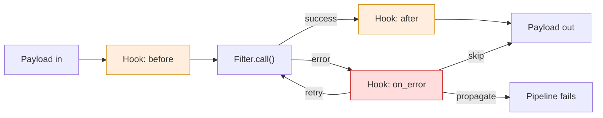

# Hook

## Prose

A **Hook** is a lifecycle callback that fires at well-known points around a Filter's execution: `before` the Filter runs, `after` it succeeds, or `on_error` if it raises. Hooks are how cross-cutting concerns — retries, timing, tracing, circuit breaking, dead-lettering — attach to a Pipeline without cluttering Filter code.

A Hook differs from a Tap in three ways: it fires at explicit lifecycle points (not just when a Payload passes), it receives the Filter name and any error alongside the Payload, and it may (in the error case) be given the option to alter the Pipeline's response — retry, skip, or fail. Even so, a Hook does not silently mutate the Payload for downstream steps.

## Analogy

A Tap is a camera watching envelopes go by. A **Hook is the belt's safety and instrumentation system**: it knows when a station is about to start (`before`), when it finishes cleanly (`after`), and when it jams (`on_error`) — and it can decide whether to buzz an alarm, retry the station, or divert the envelope to a reject bin.

## Pseudocode

```
hook TimingHook:
    before(name, payload):
        start_times[name] ← now()
    after(name, payload):
        metric.record(name, now() - start_times[name])
    on_error(name, payload, error):
        log("error in " + name + ": " + error.message)

hook RetryHook(max_attempts = 3):
    on_error(name, payload, error):
        if attempts[name] < max_attempts:
            attempts[name] += 1
            return retry
        return propagate
```

## Contract

- **Callbacks:** `before(filter_name, payload)`, `after(filter_name, payload)`, `on_error(filter_name, payload, error)`
- **Ordering:** `before` fires immediately before `call`; `after` fires after successful return; `on_error` fires on any raised error
- **Return values:** `before` and `after` are void. `on_error` may return `retry` | `skip` | `propagate`
- **Attachment:** attached to a single Filter, or globally to a Pipeline

### Invariants

- `before` cannot alter the Payload seen by the Filter
- `after` does not alter the Payload downstream unless explicitly documented
- A Hook that raises is a bug in the Hook

## Diagram



## QA

**Q:** When should I use a Hook vs a Tap?
**A:** Use a Tap when you want to see Payload data pass by. Use a Hook when you care about *lifecycle*: timing, retries, error handling, tracing spans. If you need to react to failure, only a Hook can.

**Q:** Can `before` change the Payload the Filter receives?
**A:** No. That's a Filter's job.

**Q:** How do retries work?
**A:** On error, `on_error` fires; if the Hook returns `retry`, the runtime calls the Filter again with the same Payload.

**Q:** Can multiple Hooks attach to the same Filter?
**A:** Yes. They fire in registration order.

**Q:** Are Hooks async-safe?
**A:** Runtime-dependent. Hooks operate at the same async level as Filters.

## Anti-Patterns

**Business logic in a Hook**
```
// WRONG
hook SecretlyTransform:
    after(name, payload):
        payload._data["transformed"] = true

// RIGHT — put transformation in a Filter
```

**Swallowing errors in on_error**
```
// WRONG
hook Silent:
    on_error(name, payload, error): return skip   // always
```

**Using a Hook to feed data forward**
```
// WRONG
hook StuffData:
    before(name, payload): cache[name] ← expensive_lookup()

// RIGHT — put the lookup in a Filter upstream
```
