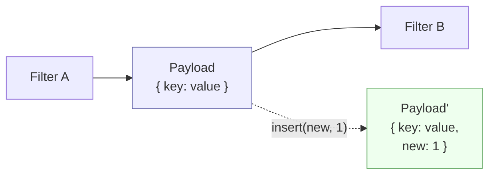

# Payload

## Prose

A **Payload** is the data envelope that flows through a codeupipe pipeline. It is a keyed container — think of it as an immutable dictionary — that carries every piece of data a Filter needs to do its job. Payloads are the *only* thing pipelines pass around. State about *how* the pipeline is running lives elsewhere (see State); the Payload holds *what* the pipeline is working on.

Payloads are immutable by default. A Filter never edits a Payload in place; it returns a new one with the changes applied. This makes reasoning about a pipeline dramatically easier: a Payload's contents at step N depend only on step N-1's return value, never on some hidden side effect.

## Analogy

A Payload is a **sealed envelope on a conveyor belt**. Each station along the belt (each Filter) opens the envelope, reads what it needs, seals a *new* envelope with updated contents, and places it back on the belt. The original envelope is preserved. Nothing on the belt is edited in place.

## Pseudocode

```
Payload { user_id: 42, raw_text: "  hello  " }

value        ← payload.get("raw_text")            // "  hello  "
missing      ← payload.get("nope") or "default"   // "default"
next_payload ← payload.insert("text", "hello")    // new Payload

payload.get("text")       // still ∅
next_payload.get("text")  // "hello"
```

## Contract

- **Shape:** keyed container, `key: string → value: any`
- **Immutability:** every mutating operation returns a new Payload; the original is unchanged
- **Access:** `get(key)` returns the value or a null-equivalent; `insert(key, value)` returns a new Payload
- **Equality:** two Payloads are equal iff they have the same keys mapping to equal values
- **Serializability:** the standard Payload holds serializable data; complex objects should be represented by identifiers or serialized forms

### Invariants

- A Payload is never edited in place by a Filter
- `payload.insert(k, v)` does not modify `payload`
- Reading a missing key never raises — it returns a null-equivalent

## Diagram



## QA

**Q:** Why is Payload immutable?
**A:** Immutability guarantees that a Filter's output depends only on its input, not on hidden mutations. This makes pipelines easy to reason about, easy to test in isolation, and safe to observe with Taps without accidentally corrupting downstream state.

**Q:** How do I update a value in a Payload?
**A:** Call `payload.insert(key, value)`. This returns a **new** Payload with the change; the original is preserved. Assign the return value: `payload = payload.insert("k", v)`.

**Q:** What happens when I read a missing key?
**A:** `get` returns a null-equivalent. Reading a missing key never raises. Use `payload.get(key) or default_value` to substitute a default.

**Q:** Can a Payload carry non-serializable objects (open sockets, file handles)?
**A:** It can, but you lose the ability to log, snapshot, or move the Payload across a process boundary. Prefer identifiers or serialized forms; keep the live resource elsewhere.

**Q:** When would I choose MutablePayload instead?
**A:** Only when profiling shows immutable copies are the bottleneck — typically large binary buffers or hot inner loops.

## Anti-Patterns

**Mutating the internal store directly**
```
// WRONG
payload._data["text"] = "hello"

// RIGHT
payload = payload.insert("text", "hello")
```

**Discarding the return value of insert**
```
// WRONG
payload.insert("text", "hello")
next_filter(payload)   // "text" is not present

// RIGHT
payload = payload.insert("text", "hello")
next_filter(payload)
```

**Using Payload for pipeline metadata**
```
// WRONG — mixes data-under-processing with execution metadata
payload = payload.insert("__step_count", 3)

// RIGHT — that belongs in State
```
