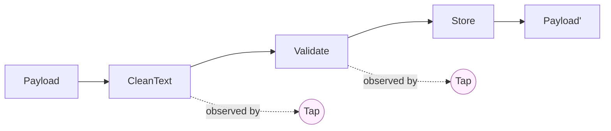
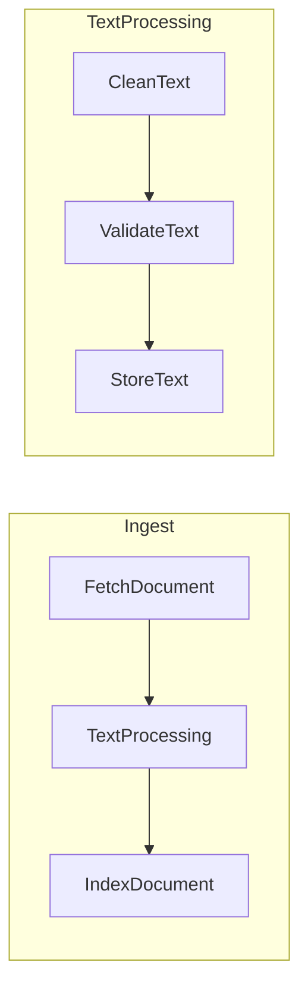

# Pipeline

## Prose

A **Pipeline** is an ordered sequence of Filters. A Payload enters the first Filter, its output flows to the second, and so on. The Pipeline itself is data — a list of steps — not another Filter with clever logic. The pipeline's power comes from composition: any Filter can be reordered, replaced, skipped (via a Valve), or observed (via a Tap) without touching the other Filters.

Pipelines can be nested — a Pipeline is itself callable as a step inside another Pipeline. This makes it natural to build small, well-tested Pipelines and compose them into larger ones.

## Analogy

A Pipeline is the **conveyor belt itself**. The Filters are the stations arranged along it. The Payload is the envelope moving down the belt.

## Pseudocode

```
pipeline TextProcessing:
    steps: [CleanText, ValidateText, StoreText]

pipeline Ingest:
    steps: [FetchDocument, TextProcessing, IndexDocument]  // nested
```

## Contract

- **Shape:** ordered list of steps; each step is a Filter or another Pipeline
- **Execution:** `run(payload)` invokes each step in order, threading the returned Payload from step N into step N+1
- **Error handling:** by default, an error in step N halts the pipeline; Hooks may intercept
- **Composition:** a Pipeline is itself invocable with the same signature as a Filter

### Invariants

- Steps execute in declared order
- Each step receives the Payload returned by the previous step
- A Pipeline never mutates the input Payload beyond what its Filters return

## Diagram



Nested composition:



## QA

**Q:** How is a Pipeline different from just calling Filters manually?
**A:** A Pipeline is a **data structure** describing the composition. You can inspect it, log it, visualize it, insert observation (Taps), add gates (Valves), and swap steps without editing the calling code.

**Q:** Can steps run in parallel?
**A:** Yes, if the runtime supports it and the steps declare no data dependencies. The default is sequential.

**Q:** What happens on error?
**A:** By default, an error in step N halts the Pipeline and propagates. A Hook can intercept `on_error` to log, retry, or route to a dead-letter path.

**Q:** Can I skip a step conditionally?
**A:** Yes — wrap the step with a Valve.

**Q:** Can two Pipelines share a Filter instance?
**A:** Yes, as long as the Filter is safe to share (no mutable per-invocation state).

## Anti-Patterns

**Encoding branching inside a Filter instead of using Valves**
```
// WRONG
filter ProcessMaybe:
    body:
        if payload.get("skip"): return payload
        else: return heavy_work(payload)

// RIGHT
valve WhenNotSkipped gates HeavyWork: predicate = not payload.get("skip")
```

**Passing metadata as Payload fields to steer flow**
```
// WRONG
payload.insert("__route", "premium")

// RIGHT — routing is Valves, not encoded flags
```

**Monolithic Pipeline with 30 unrelated steps**
```
// RIGHT — small, testable, composed Pipelines
pipeline Ingest: steps: [Fetch, Parse, Normalize]
pipeline Process: steps: [Validate, Transform, Enrich]
pipeline Persist: steps: [Serialize, Store, Index]
pipeline Full: steps: [Ingest, Process, Persist]
```
