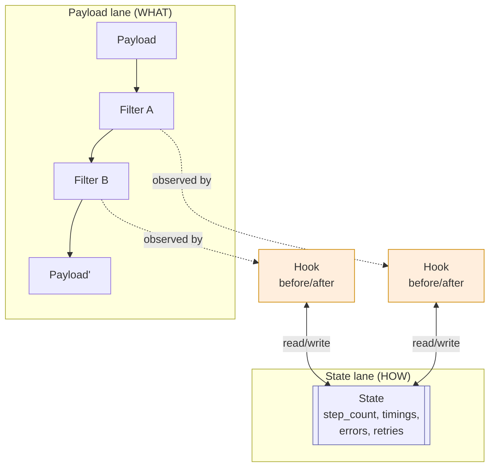

# State

## Prose

**State** is execution metadata about *how* a Pipeline is running: which step we're on, when it started, how long each Filter took, what errors have occurred, how many retries have happened. State is deliberately separate from Payload. Payload is *what* the pipeline is working on; State is *how* the pipeline is doing its work.

This separation matters. Mixing execution metadata into the Payload pollutes the data with framework concerns and breaks the reasoning "Filter output depends only on Filter input." State is available to Hooks and Taps that need it, but Filters see only Payload — and that's a feature.

## Analogy

If Payload is the envelope on the conveyor belt and Filters are the stations, State is the **clipboard hanging on the wall of the control room** — timestamps, step counts, error log, retry counter. Stations do their work on envelopes; the control room reads and writes the clipboard.

## Pseudocode

```
state:
    step_count:     integer
    started_at:     timestamp
    current_step:   string
    filter_timings: map<filter_name, duration>
    error_count:    integer
    retries:        map<filter_name, integer>

hook TimingHook:
    before(name, payload, state):
        state.current_step ← name
        state.step_count += 1
        state.filter_timings[name] ← now()
    after(name, payload, state):
        state.filter_timings[name] ← now() - state.filter_timings[name]
```

## Contract

- **Shape:** an object holding execution-level metadata
- **Scope:** created at Pipeline start, lives for the duration of the Pipeline run
- **Access:** available to Hooks and Taps; **not visible to Filters** by default
- **Mutability:** written by the runtime and by Hooks; not read by Filters

### Invariants

- Filters do not read or write State
- State does not carry domain data — only execution metadata
- State is reset per Pipeline invocation

## Diagram



## QA

**Q:** Why can't Filters see State?
**A:** So that a Filter's behavior depends only on its Payload input. Testing a Filter in isolation must not require setting up execution metadata that has nothing to do with the Filter's job.

**Q:** Where does "retry count" belong — Payload or State?
**A:** State. Retry count is metadata about how the pipeline is executing.

**Q:** How does State interact with parallel Pipelines?
**A:** Each Pipeline run has its own State.

**Q:** Can I persist State across runs?
**A:** Some runtimes provide persistent State (checkpointing). By default State is per-run and in-memory.

**Q:** What's in State that isn't in a good logging system?
**A:** State is *structured*, in-process access to what a good logging system would emit — available synchronously to Hooks and Taps that need to make decisions (retry? circuit-break?).

## Anti-Patterns

**Storing execution metadata on the Payload**
```
// WRONG
payload = payload.insert("__step_count", 3)
payload = payload.insert("__started_at", now())

// RIGHT — that's State's job
```

**Filter reading State to branch behavior**
```
// WRONG
filter Adaptive:
    body:
        if state.step_count > 5: return light_work(payload)
        else: return heavy_work(payload)
```

**Domain data on State**
```
// WRONG
state.current_user ← payload.get("user")

// RIGHT — domain data on Payload; State for execution info only
```
