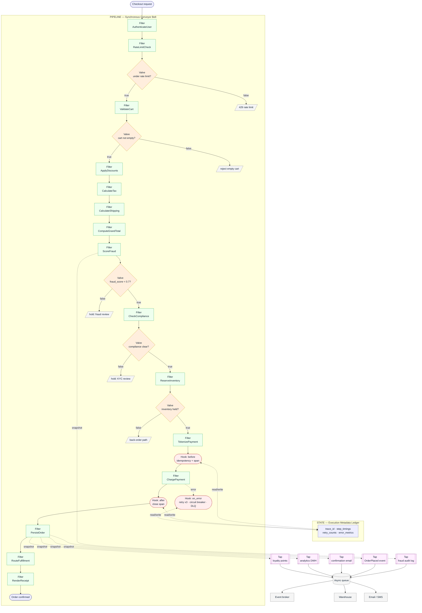

# Codeupipe System Overview

## Prose

Codeupipe (CUP) is an architectural pattern and programming paradigm constructed around a strict, immutable, and asynchronously aware implementation of the classic Pipes and Filters pattern. The goal of Codeupipe is to make complex backend workflows inspectable, composable, and resilient by treating execution pipelines as pure, declarative data structures.

Traditional applications suffer from deep coupling: business logic, conditional routing, error handling, performance telemetry, and event dispatching are tangled within monolithic routines. Codeupipe cleanly decouples these concerns into **seven specialized primitives**, divided across two operational execution planes: the **Synchronous Conveyor Belt** and the **Asynchronous Detached Boundary**.

### Primitives of the Conveyor Belt (Core Transaction)

- **Payload** — the immutable dictionary containing domain data moving along the line.
- **Filter** — the atomic, single-responsibility step performing computation on the Payload.
- **Pipeline** — the ordered sequence of steps defining the execution layout.
- **Valve** — the conditional gate governing whether a step is run based on a pure predicate.

### Primitives of the Detached Boundary (Instrumentation & Observability)

- **Tap** — a read-only, non-blocking observer of Payload flow. Taps are the primary integration point for asynchronous, out-of-band side effects (event buses, message queues).
- **Hook** — a lifecycle callback manager firing specifically before, after, or on_error around Filter execution to handle cross-cutting runtime actions (retries, tracing spans).
- **State** — structured execution metadata ledger. It tracks how the pipeline is running and is completely isolated from Filters.

By enforcing a complete separation of domain data (Payload) from execution metadata (State), and synchronous execution logic (Filters) from asynchronous side effects (Taps), Codeupipe ensures your core system remains fast and unburdened by network latency, external brokers, or heavy tracing writes.

## Analogy

Codeupipe is an automated factory assembly line:

- **Payload** — a sealed envelope moving down the conveyor.
- **Filter** — a specialized workspace: opens the envelope, produces a new updated envelope.
- **Pipeline** — the conveyor belt layout itself.
- **Valve** — a physical track diverter that inspects the label and decides whether the envelope enters a workspace.
- **Tap** — a high-speed camera that photographs passing envelopes and wires the images to a detached warehouse. It never stops the belt.
- **Hook** — the emergency stop buttons, sirens, and retry mechanisms.
- **State** — the supervisor's clipboard hanging on the control room wall. Workers never look at it.

## Pseudocode

```
filter NormalizePhone:
    body:
        raw ← payload.get("phone") or ""
        clean ← regex_replace(raw, "[^0-9]", "")
        return payload.insert("phone", clean)

valve WhenHasPhone gates NormalizePhone:
    predicate(payload): return payload.get("phone") != null

tap PublishUserRegistered observes NormalizePhone:
    on_payload(payload):
        async_dispatch(event_bus.publish("user.registered", {
            "user_id": payload.get("user_id"),
            "email":   payload.get("email"),
        }))

pipeline UserIngestionPipeline:
    steps:
        - AuthenticateUser
        - WhenHasPhone(NormalizePhone)
        - WriteToDatabase
```

## Contract

- **Unidirectional Flow** — Payloads flow strictly in one direction.
- **Strict Data Isolation** — Filters only see Payload data. They cannot view, modify, or depend on State.
- **Zero In-Place Mutation** — every modification of a Payload yields a new Payload reference.
- **Declarative Flow Control** — routing decisions are elevated to Pipeline structures (via Valves), not hidden inside `if` statements.
- **Asynchronous Tap Isolation** — a Tap must never perform blocking operations on the primary execution thread.
- **Invisible Telemetry** — removing all Hooks and Taps must have zero effect on the primary domain outcome.

### Invariants

- A Pipeline's execution path is fully traceable statically just by reading its declaration.
- Same Payload + same Filters → identical output, regardless of State telemetry or Taps triggered.

## Diagram

*Real-world flow: a Fortune-100 e-commerce checkout pipeline.*



**Reading the flow:**

1. **Payload** enters as the checkout request and flows left-to-right through the conveyor.
2. **Valves** gate expensive work — an empty cart short-circuits; a high fraud score diverts to manual review.
3. **Filters** do the domain work: validate → tax → charge → reserve → persist. Each is a pure transformation.
4. **Hooks** wrap the payment Filter with tracing spans and retry-with-backoff on failure — never touching the domain payload.
5. **State** is the ledger Hooks read/write; Filters are blind to it.
6. **Taps** fork read-only snapshots to an async queue at 0-ms cost. Downstream consumers (broker, warehouse, notifications) never block the checkout.

## QA

**Q:** Why not just write standard procedural code?
**A:** Procedural code quickly becomes tangled. When logging, retries, DB transactions, and conditional event dispatching are mixed into business logic, components become impossible to test without complex mock setups. Codeupipe forces separation of concerns.

**Q:** How does Codeupipe prevent a slow downstream consumer from breaking the system?
**A:** By leveraging the asynchronous detached boundary. Logging, metrics, webhooks, and event-bus dispatching go into Taps that immediately offload the snapshot payload to a thread pool or background loop.

**Q:** When should an action be a Filter vs an Async Tap?
**A:** Ask: *"If this action fails, must the whole operation fail?"* If yes (deducting money, validating a password), it's a Filter. If no (sending a welcome email, warming a cache), it's a Tap.

**Q:** Where do DB connections, HTTP clients, and configuration constants live?
**A:** As instance configuration on the Filter. The Payload carries transient run-specific data only.

## Anti-Patterns

**Blocking the Conveyor with Side-Effects**
```
// WRONG — primary pipeline stalls on network
tap SyncEventBus observes CleanText:
    on_payload(payload):
        http_client.post_sync("https://event-bus/publish", payload.to_json())

// RIGHT
tap AsyncEventBus observes CleanText:
    on_payload(payload):
        event_dispatcher.emit_detached("text.cleaned", payload.to_json())
```

**Mixing Flow Control with Processing**
```
// WRONG
filter ChargeUser:
    body:
        if payload.get("subscription_type") = "premium":
            return stripe.charge(payload, 50)
        else: return payload

// RIGHT
valve WhenPremium gates ChargeUser: predicate = subscription_type == "premium"
pipeline Billing: steps: ["WhenPremium(ChargeUser)"]
```

**Storing Execution Metadata on the Payload**
```
// WRONG
filter RecordDatabaseLatency:
    body:
        start ← now()
        new_payload ← db.save(payload)
        return new_payload.insert("_db_latency_ms", now() - start)

// RIGHT — belongs in State, observed by Hooks
hook TelemetryHook:
    before(name, payload, state): state.filter_timings[name] ← now()
    after(name, payload, state):  state.filter_timings[name] ← now() - state.filter_timings[name]
```
