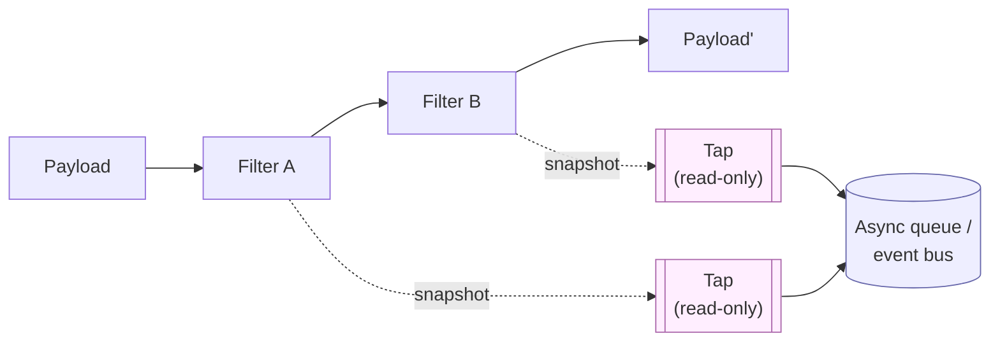

# Tap

## Prose

A **Tap** is a read-only observer attached to a Filter or Pipeline edge. It sees the Payload flowing past, does something with what it sees — log it, record a metric, emit an event — and returns nothing. A Tap must not modify the Payload or the pipeline's result. Removing every Tap from a Pipeline must not change what the Pipeline produces.

Taps are the primary observability primitive in codeupipe. Logging, metrics, tracing, and auditing are all Taps. This is deliberate: it keeps observation separate from computation, so instrumentation can be added, removed, or reconfigured without touching Filters.

## Analogy

A Tap is a **camera pointed at the conveyor belt**. It watches every envelope go by and records what it sees. It never opens the envelopes, never edits them, never blocks the belt.

## Pseudocode

```
tap LogCleanedText observes CleanText:
    on_payload(payload):
        log("cleaned: " + payload.get("text"))

tap CountFilterInvocations observes any Filter:
    on_payload(payload):
        counter[current_filter_name] += 1
```

## Contract

- **Signature:** `on_payload(payload) → void`
- **Purity:** does not modify the Payload, does not affect downstream steps
- **Attachment:** to a specific Filter, Pipeline edge, or globally
- **Failure mode:** a failing Tap does not halt the Pipeline; it is logged and skipped

### Invariants

- Removing all Taps from a Pipeline produces the same output
- A Tap does not raise into the Pipeline
- A Tap does not consume so much resource that it changes Pipeline behavior

## Diagram



## QA

**Q:** Why can't a Tap modify the Payload?
**A:** Because if it could, you could no longer reason about what a Pipeline does by reading the Pipeline. Observation must be invisible to computation.

**Q:** What's the difference between a Tap and a Hook?
**A:** A Tap observes Payload flow between Filters. A Hook fires at Filter lifecycle points (before, after, on_error). Taps are for data observation; Hooks are for lifecycle observation.

**Q:** What if my Tap needs to write to a database?
**A:** Fine, but the write must not slow the Pipeline meaningfully. If the Tap fails, the Pipeline still succeeds. Batch or async the write.

**Q:** Can I have multiple Taps on the same Filter?
**A:** Yes. Taps compose freely.

**Q:** How do I test that a Tap doesn't affect a Pipeline?
**A:** Run the Pipeline twice — once with the Tap, once without — and assert the output Payloads are equal.

## Anti-Patterns

**Tap that mutates the Payload**
```
// WRONG
tap InjectTimestamp:
    on_payload(payload): payload.insert("ts", now())

// RIGHT — this is a Filter
filter AddTimestamp: body: return payload.insert("ts", now())
```

**Tap that raises into the Pipeline**
```
// WRONG
tap RequireField:
    on_payload(payload):
        if payload.get("required") = ∅: raise "missing"
```

**Heavy synchronous work in a Tap**
```
// WRONG — 5s HTTP call synchronously
on_payload(payload): http_post_sync(analytics_url, payload)

// RIGHT — async or batched
on_payload(payload): analytics_queue.push(payload)
```
