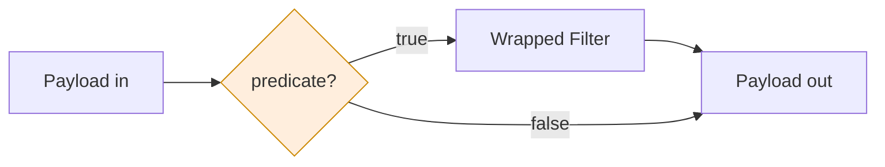

# Valve

## Prose

A **Valve** is a conditional gate wrapping a Filter. It evaluates a predicate against the Payload; if true, the wrapped Filter runs; if false, the Payload passes through unchanged. Valves are how branching is expressed in codeupipe — not by putting `if` statements inside Filters, but by declaring the condition alongside the Filter in the Pipeline.

This separation is what makes Pipelines inspectable. The Pipeline's declaration reveals *when* each Filter is eligible to run; a reader doesn't need to open the Filter's source to find hidden routing logic.

## Analogy

A Valve is a **swing-arm diverter** on the belt in front of a station. When conditions are right, the arm swings up and the envelope enters that station. When they aren't, the arm blocks the entry and the envelope continues down the belt untouched.

## Pseudocode

```
valve WhenAdmin gates ProcessAdminOnly:
    predicate(payload) → boolean:
        return payload.get("role") = "admin"

pipeline UserFlow:
    steps:
        - AuthenticateUser
        - WhenAdmin(ProcessAdminOnly)
        - CommonFinalize
```

## Contract

- **Shape:** wraps exactly one Filter (or nested Pipeline)
- **Predicate:** a pure function `Payload → boolean`
- **Behavior on true:** invokes the wrapped Filter, returns its output Payload
- **Behavior on false:** returns the input Payload unchanged
- **No side effects in predicate:** must not mutate the Payload or perform external work

### Invariants

- The predicate is pure and side-effect-free
- A false predicate never modifies the Payload
- The Valve is declared in the Pipeline, not hidden inside a Filter

## Diagram



## QA

**Q:** Why can't I just put an `if` inside my Filter?
**A:** You can, but you shouldn't. The Pipeline is meant to be inspectable — a reader should see routing decisions in the Pipeline declaration.

**Q:** What if my predicate needs external data (a database)?
**A:** Fetch the data in an earlier Filter, put it on the Payload, and let the predicate read it. Predicates must be pure.

**Q:** Can a Valve wrap a whole nested Pipeline?
**A:** Yes. A Valve gates one step, and a step can be a Pipeline.

**Q:** How do I express if/else?
**A:** Two Valves with complementary predicates, each wrapping the appropriate Filter.

## Anti-Patterns

**Predicate with side effects**
```
// WRONG — predicate mutates
predicate:
    payload.insert("checked", true)
    return payload.get("go")
```

**Branching hidden inside a Filter**
```
// WRONG
filter Maybe:
    body:
        if payload.get("skip"): return payload
        else: return heavy(payload)

// RIGHT
valve WhenNotSkipped gates Heavy: predicate = not payload.get("skip")
```

**Valve wrapping unrelated logic**
```
// WRONG — predicate has nothing to do with the wrapped Filter
valve WhenTuesday gates SendPasswordReset: predicate = today() = "Tuesday"
```
